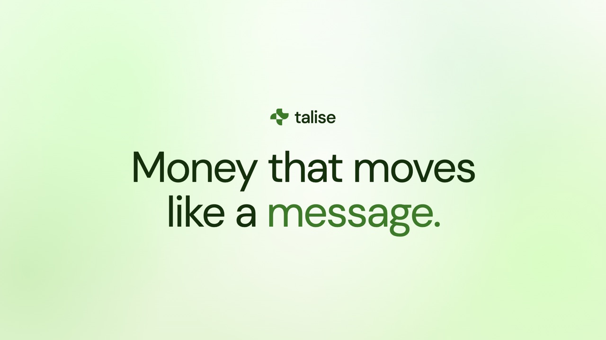

# Talise

**Money that moves like a message.**

A gasless US dollar account on Sui. Sign in with Google, hold dollars, and send them to a name like `vanessa@talise.sui`. No seed phrase, no gas, settles in under a second, and a send can be private with the amount hidden on chain. Live on mainnet.

[Website](https://talise.io) · [iOS app (TestFlight)](https://testflight.apple.com/join/BFNEPYtM) · [Pitch deck](https://talise.io/overflow-pitchdeck) · [X](https://x.com/taliseio)

---

### What we are building

Payments and DeFi are disconnected: payments are static transfers, DeFi is complex and siloed, and people are left to orchestrate everything by hand. Talise turns a payment into a programmable financial action on Sui, wrapped in an app that feels like a neobank.

You sign in with Google, hold dollars as USDsui, and pay anyone by `@handle` instead of a 0x address. Sending is gasless and settles in under a second. A send can be private, with the amount hidden on chain. Idle balance is put to work, dollars cash in and out to a bank, and money can move as a claim link or a stream.

### How it works

- **Identity.** zkLogin turns a Google account into a self-custodial Sui wallet. The user never handles a key.
- **Settlement.** Balances are USDsui, a US dollar token on Sui, moved with sub-second finality.
- **Gas.** Every transaction is sponsored, so the user never holds or spends a gas token.
- **Names.** Everyone claims `name@talise.sui`, a real on-chain SuiNS identity that money routes to.
- **Privacy.** A Groth16 shielded pool hides the amount on chain and unlinks sender from recipient, live on mainnet.

### What is live

Live on Sui mainnet. Public beta on iOS via TestFlight, with the website at talise.io. Over 1,900 names on the waitlist and over 1,400 `@handles` already claimed on chain. Gasless sends, private sends, claim links, streaming, and bank cash-out all work in the shipped build.

### Repositories

- **[talise-frontend](https://github.com/talise-public/talise-frontend)**, web app and API. Next.js, TypeScript.
- **[talise-mobile](https://github.com/talise-public/talise-mobile)**, iOS app. Swift, SwiftUI.
- **[talise-contracts](https://github.com/talise-public/talise-contracts)**, Sui Move packages: payments, privacy, savings, yield.
- **[talise-infra](https://github.com/talise-public/talise-infra)**, the gas-sponsorship service.
- **[talise-docs](https://github.com/talise-public/talise-docs)**, overview, architecture, and pitch deck.

### Primary working repository

All day to day development happened in the primary working repository, then migrated into these focused repositories for clarity:

**https://github.com/SeventhOdyssey71/talise-main**

### Built on Sui

zkLogin for keyless self-custody, sponsored gas for a gasless experience, sub-second finality so payments feel instant, programmable transaction blocks for composability, and a Move-based shielded pool for privacy.
